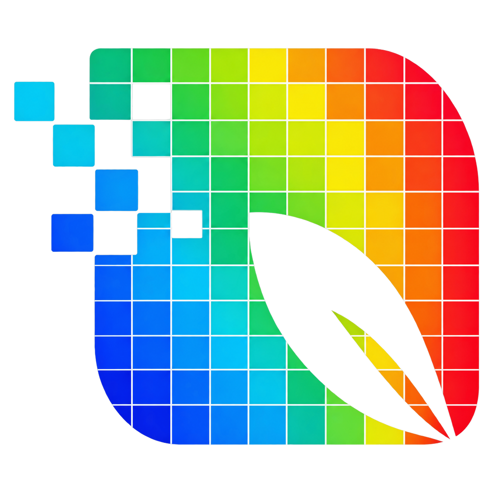

# Leaf VSA

Desktop software for the **ESP32 + BME690 + AS7343** leaf volatile and spectral sensor. It runs the measurement, saves every reading to a local database, and helps compare treatments using an odor fingerprint (metal-oxide gas sensor) and a VNIR spectrum (reflectance and transmission).

> **Download:** get the latest installer from [Releases](../../releases/latest).
> Use `LeafVSA_<version>_x64-setup.exe` (recommended) or the `.msi`. Windows 10/11, 64-bit.

---

## Features

- **Data acquisition**: start and stop measurements, with live charts of every gas reading, the odor fingerprint and the VNIR spectrum.
- **Gas resistance timeline**: every timed gas read of a measurement (conditioning and channel scan), live and in the Visualization.
- **Odor signal share**: the total odor signal (Σ log₁₀ R_blank / R_sample over all channels, an index of VOC emission) and each channel's share of it, live and in the Visualization. The total is also available as a single-value bar chart.
- **Experiments and factors**: organize samples by experiment, factor (e.g. *Treatment*) and group (e.g. *Control*, *Leaf*). Experiments can be password protected.
- **Visualization**:
  - add charts for single samples or a group average
  - **Mean ± SD** boxes
  - **Difference (A − B)** boxes
  - **Group** boxes that overlay several samples or boxes, with a colour you pick for each series
  - **PCA** boxes: add sample groups one by one and see them on PC1 / PC2 (odor fingerprint, VNIR or both), with a colour you pick for each group and a 95 % ellipse
  - single-value bar charts
  - PNG export of any chart
- **Data Management**: a spreadsheet-like table of every measurement in the experiment (time, sample, cycle, blank or sample, factor groups, temperature, humidity, pressure, notes). Sort and search it, change a sample's group in its cell or for many selected samples at once, edit notes, delete wrong samples (a database backup is saved first) and export CSV.
- **Firmware check and update**: when the ESP32 is plugged in, the app reads its firmware version. If it differs from the firmware bundled with the app, one click flashes the matching firmware. No Arduino IDE is needed.
- **Automatic app updates**: the app checks this repository for new versions and can download, install and restart by itself. Updates are signed.

## Getting started

1. Install the app from [Releases](../../releases/latest). The first install is manual; later versions arrive as in-app updates.
2. Plug in the ESP32 with a USB cable. In the **Connect the ESP32** dialog, pick its serial port (baud rate 115200).
3. If the firmware status shows **Update** or **Install**, click it and wait until it reports *up to date*. Keep the cable plugged in while it runs.
4. Choose or create an experiment. Add factors and groups under **Factors/Treatments**.
5. Put the analyzer in the **blank setup** (activated-carbon filter box on the base, LED lid on top) and press **Run blank** on **Data Acquisition**. This is needed after every app start and every hour.
6. Take the LED lid and the filter box off, lay the leaf on the base over the sensor window, put the LED lid on the leaf, select its group, set the number of cycles and press **Start**.

If the USB cable is pulled during a measurement, the app stops it, keeps the cycles that had finished and tells you; plug the ESP32 back in and start again.

The ESP32 warms up its gas sensor for about 90 s after every power-on or reset. The firmware check also resets the board, so a measurement started straight after plugging in begins once the warm-up is done.

## Hardware

| Part | Connection |
|---|---|
| ESP32 dev board (`esp32:esp32:esp32`) | USB to the PC |
| Bosch BME690 (gas, temperature, humidity, pressure) | I²C bus 0: SDA 21, SCL 22, address 0x76 |
| ams OSRAM AS7343 (spectral sensor; its on-board LED is used for reflectance) | I²C bus 1: SDA 33, SCL 32, address 0x39 |
| External LED for transmission | GPIO 4 |

## Measurement protocol (v17)

Each cycle runs these steps in order:

1. **Reflectance**: AS7343 with its LED on for 3 s.
2. **Transmission**: external LED on for 3 s.
3. **Gas sensor conditioning**: 40 °C (1 s) ↔ 400 °C (1 s), repeated until the 40 °C reading is stable (10–60 cycles).
4. **Gas channel scan**: 13 heater targets from 40 °C to 400 °C in 30 °C steps. Each channel runs:
   - **PRE**: 40 °C for 1 s
   - **TARGET**: a quick read at about 0 s (T0), then reads at 1, 2 and 3 s (T1–T3)
   - **POST**: 400 °C for 1 s

The **odor fingerprint** is log₁₀(R_blank / R_sample) of the T3 reading for each channel. Values above 0 mean the sample lowers the resistance. The **total odor signal** is the sum of the fingerprint over all channels (negative channels count as 0); each channel's **share** is its part of that total, which describes the odor pattern independently of how strong the emission is. The VNIR spectrum covers 12 bands from 405 to 855 nm.

### Blank (activated-carbon filter)

A **blank** is one measurement cycle in the **blank setup**: the activated-carbon filter box sits on the base with its opening over the sensor window, and the LED lid closes it on top, so the sensor only sees filtered air. It is the reference for the fingerprints of the samples measured after it. The app asks for a new blank:

- after every app start, and
- once the blank is an hour old.

Press **Run blank** on Data Acquisition in the blank setup. Sample measurements start only while a blank is valid. In the Visualization, blanks appear as the group *Blank*.

**Keep the analyzer in the blank setup whenever you are not measuring a leaf.** The carbon filter keeps room odors away from the sensor, so it stays clean and the next blank and sample start sooner.

For a **sample**, lift the LED lid, take the filter box off the base, lay the leaf flat on the base so it covers the sensor window, and put the LED lid (LED facing down) straight on the leaf.

When a sample measurement finishes, the app asks you to take the leaf out and return to the blank setup, and then **cleans the sensor**: rounds of 400 °C heating, each followed by a check of the 40, 70 and 100 °C channels with the measurement timing. Rounds repeat until 40 and 70 °C read the 102.4 MΩ ceiling and 100 °C reads the ceiling or the same as the round before (within 3 %); the next blank or sample can start only after that.

Leave the analyzer in the blank setup for at least 5 minutes after a sample before running a blank. Each new blank is checked twice:

- **Low temperature:** in clean air nothing burns at low temperature, so every target read at 40, 70 and 100 °C must stay at the 102.4 MΩ ceiling. 40 and 70 °C always must; 100 °C may stay below it if two blanks in a row read the same at 40–100 °C (within 3 %). Until then, the app discards the blank and runs another one by itself (press **Stop** to end).
- **Recent blanks:** at 70–250 °C it should not read about 20 % or more below the last five accepted blanks.

A blank whose 40–100 °C reads differ by more than 10 % from both of the last two accepted blanks is also run again by itself; two blanks in a row that agree (within 3 %) become the new baseline.

Each analyzer reports its own ID (the ESP32's MAC address), and blanks are kept per analyzer: a blank only serves samples measured on the same analyzer, and blanks are only compared with earlier blanks of that analyzer. Plugging in another analyzer asks for a new blank.

While the ESP32 is plugged in and idle, its heater keeps pulsing (**keep-warm**), so the sensor does not cool down and drift between measurements. A new sensor reaches a stable 100 °C reading only after some hours of heating; leave a new analyzer plugged in (keep-warm burns it in) before the first experiment.

If the second check fails, odor is probably still around the sensor (or the carbon needs replacing), and the app offers to discard the blank and run it again.

## Data

- All readings are stored in a SQLite database at
  `%LOCALAPPDATA%\CMU BME690 Research\Plant Stress Analyzer\bme690_data.sqlite`
  (the folder keeps the app's former name). The database is kept when the app is updated or reinstalled.
- Experiments can be exported to CSV on the **Data Management** page (you choose where to save the file), where each sample's factor groups and notes can also be corrected. The default export has one row per sample measurement: its factor groups, the odor fingerprint log₁₀(R_blank / R_sample) at each heater temperature, and the raw VNIR reflectance and transmission counts (405–855 nm). A detailed export of all measurement features is also available.

## Former name

Leaf VSA was called **Plant Stress Analyzer** up to version 0.29. Installed copies update to Leaf VSA by themselves; the installer removes the old "Plant Stress Analyzer" entry and keeps all data.
This repository was also renamed from `plant-stress-analyzer` to `leaf-vsa`; GitHub forwards the old address, so older installs still find their updates.

## Version numbers

The app and the ESP32 firmware always share the same version number. Each app release bundles its matching firmware, so updating the app and then clicking **Update** on the firmware status keeps both in step.

## Credits

Copyright © 2026 Assistant Professor Dr. Chun-I Chiu,
Department of Entomology and Plant Pathology, Faculty of Agriculture, Chiang Mai University.

The installer includes [esptool](https://github.com/espressif/esptool) by Espressif Systems (GPL-2.0), used unmodified to flash the ESP32 firmware. Its licence is installed alongside it (`firmware/esptool-LICENSE.txt`).

## Development

The repository holds the desktop app; the ESP32 firmware is `../BME690_AS7343_Plant_Stress_Analyzer.ino` (one folder up, next to the Bosch BME69X driver files). The folder and file names still carry the former name.

| Command | What it does |
|---|---|
| `npm install` | Install the frontend and Tauri CLI dependencies. |
| `npm run tauri dev` | Run the desktop app with serial-port access (development database in the folder above). |
| `npm run build:firmware` | Compile the firmware with `arduino-cli` and bundle `firmware.bin` and `esptool.exe` into `src-tauri/resources/firmware/`. Runs before every app build. |
| `npm run release -- "notes"` | Build the signed installers and write `release/v<version>/` (setup.exe, its .sig, .msi, `latest.json`) for a GitHub release. |
| `cargo test` (in `src-tauri/`) | Run the backend tests. |

Requirements: Node.js, Rust, the Arduino IDE (its `arduino-cli`) with the `esp32:esp32` core and the SparkFun AS7343 library, and the updater signing key (`~/.tauri/plant-stress-analyzer.key`, or `TAURI_SIGNING_PRIVATE_KEY`).

**Releasing a version**

1. Set the same version in `package.json`, `src-tauri/tauri.conf.json`, `src-tauri/Cargo.toml`, `APP_VERSION` in `src/App.tsx`, and `FIRMWARE_VERSION` and the header of the `.ino`. The firmware build stops if the firmware and app versions differ.
2. Run `npm run release -- "What changed"`.
3. Create a GitHub release tagged `v<version>`, upload the four files from `release/v<version>/` and mark it as the latest release. Installed apps pick it up from `releases/latest/download/latest.json`.

Keep the signing key safe: without it no further update can reach installed apps.

**Layout**

| Path | Contents |
|---|---|
| `src/App.tsx`, `src/App.css` | React frontend (all pages). |
| `src-tauri/src/lib.rs` | Rust backend: serial logging, SQLite, blank and cleaning checks, exports, firmware flashing. |
| `src-tauri/tauri.conf.json` | App name, identifier, bundle and updater settings. |
| `src-tauri/windows/hooks.nsh` | Installer hook that removes a former "Plant Stress Analyzer" installation. |
| `scripts/` | Firmware build and release scripts. |
| `public/` | Logo and the setup photos shown in the blank and sample dialogs. |

[Tube VSA](https://github.com/TermCIC/tube-vsa) is a BME690-only version of this app with the same measurement protocol (v17).
